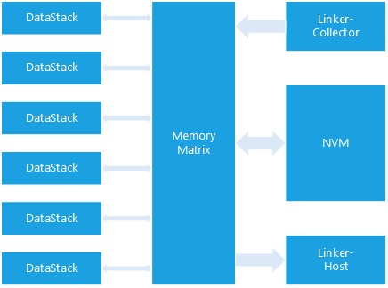
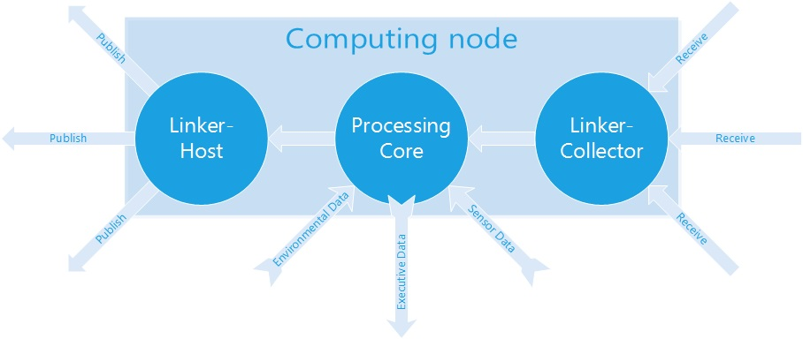
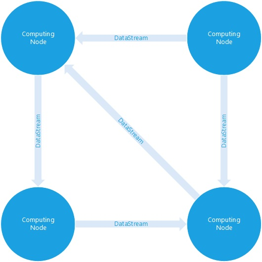
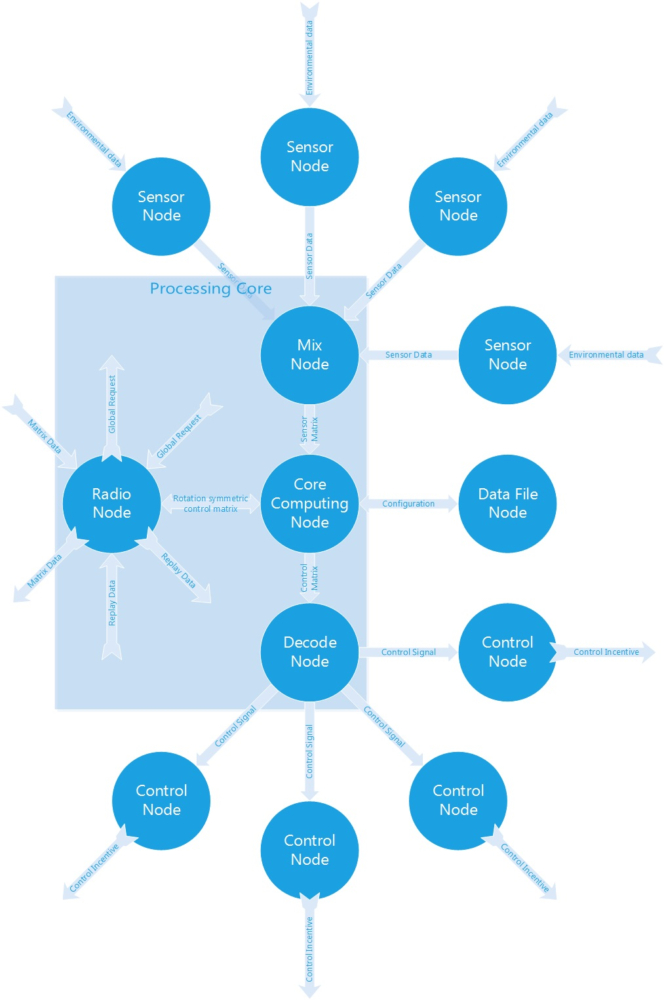
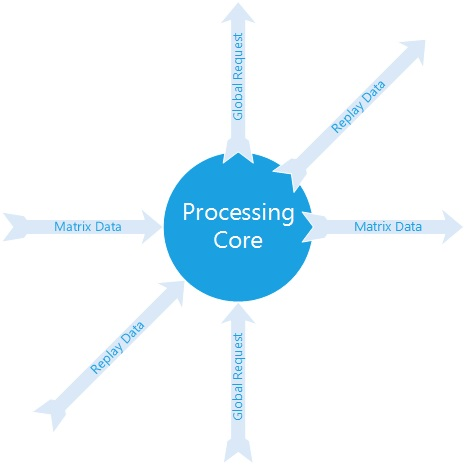
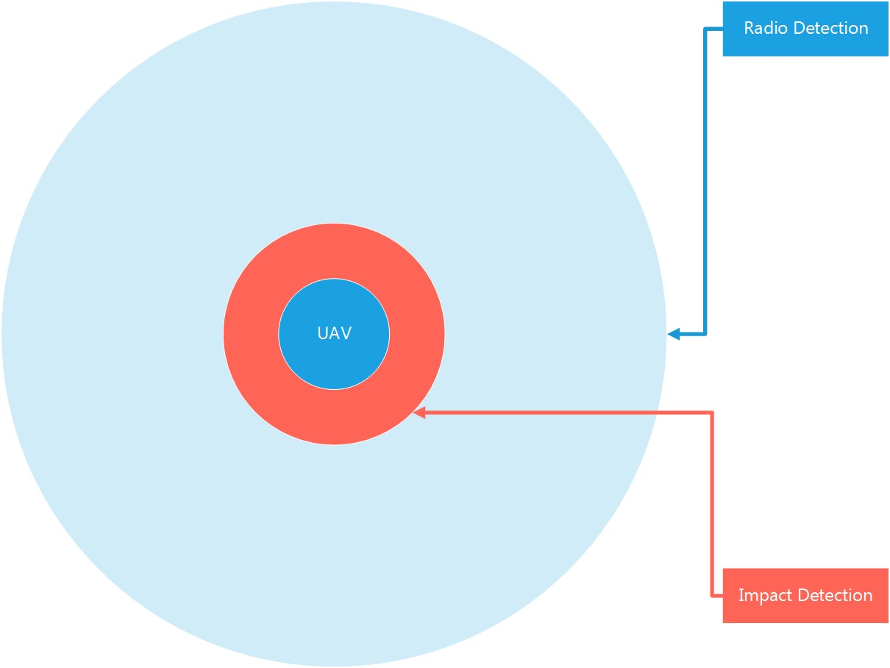
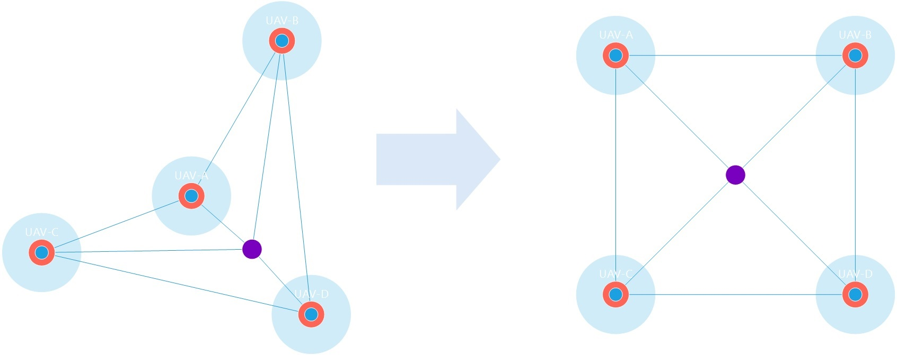
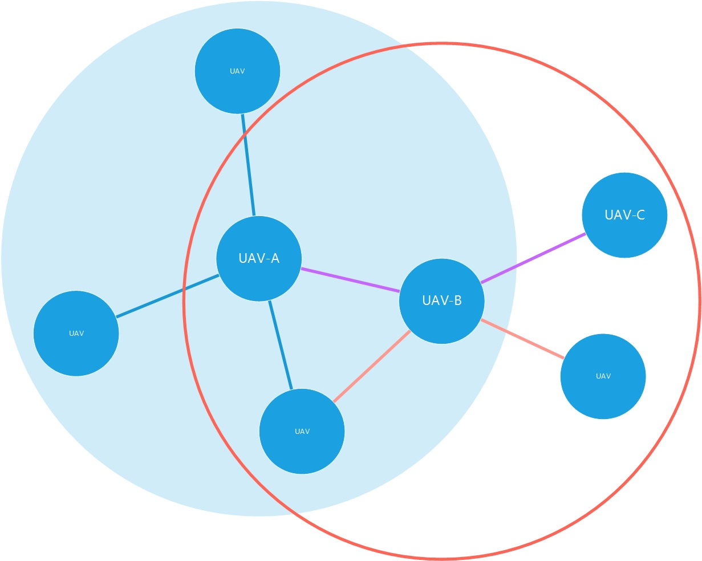

#Abstract

Forest Operating System (FOS) is a concurrently, distributed, 
cuttable, real-time operating system framework.

It is contructed form hardware level, to application level.

#Contents

- [1.Computing Node](#user-content-1)

- [2.UAV Control Model](#user-content-2) 

- [3.Group Control Model](#user-content-3) 

- [4.Radio communication](#user-content-4)

- [5.Communication Protocol Stack](#user-content-5)

- [6.topological](#user-content-6)

- [7.Muliti Group](#user-content-7)

#Computing Node

##Brief
##Model
###Firmware model

###Data stream model

###Network model

###Future
Maybe we could actrualize a number of full-functional computing nodes group in a FPGA or ASIC by using open-source project [RISC-V](riscv.org)
 

##Memory Management Unit (MMU)

###Brief
In FOS, every computing Node is contructed by a core unit whitch is a MMU.
FOS's MMU can be a soft implementation, 
a hard implementation or a mixed implementation.

In order to actrualize this unit easily, 

MMU's I/O is mulitable,

###Model

###Actrualize

###I/O

##Linker
###Brief
Linker is a specific data stack, which is used to share data between two different computing node.
###Model

##Data stacks
###Brief
###Model

#UAV Control Model
###Brief
###Model

As a black box, this Control model seems like:

Or in real world it seems like:

#Group Control Model

##Problem Model

this problem is to consider about a group of UAVs,need to form a queue, a rectangle, a triangle or other geometries.

consider the number of UAVs is unknow, this problem will be a complex issues.

##Basic Model

For now, I just design a model to describe a controller with two UAVs.

Suppose one UAV can move as wanted. I need two UAVs control each self without third party's interference.

##Promotion

#Radio communication

#Communication Protocol Stack

#Topological

#Muliti Group
